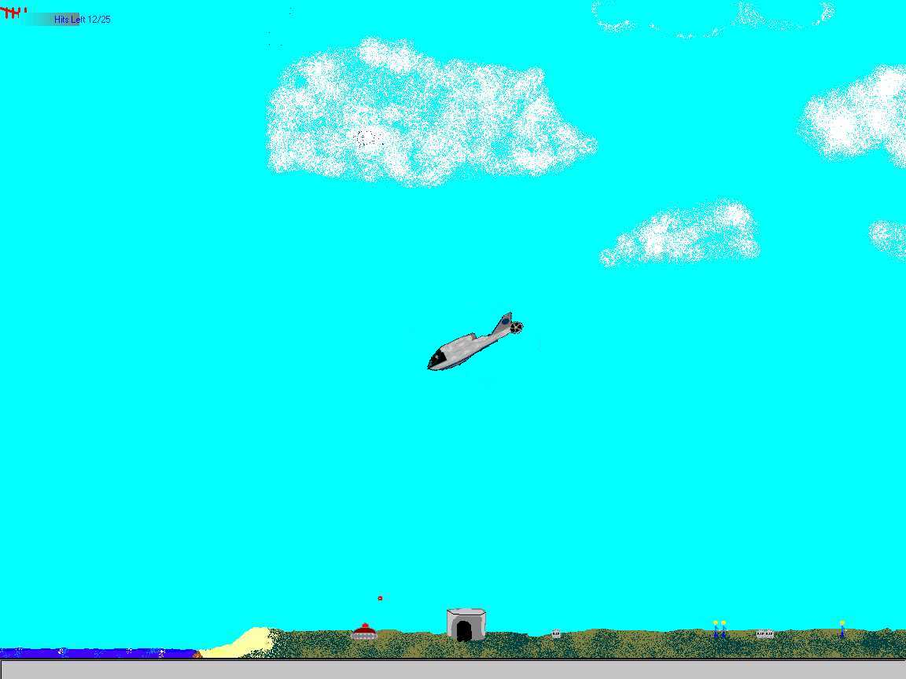



## Choplifter

### Description

This is a remake of the classic game Choplifter.

If you are just browsing through looking for a game that could help pass the time or one that you want to improve upon, download this one. All the source code is included if you want to make any changes.

It does take up about 15 megs once it's uzipped(only 500kb zipped) but its worth every bit of it.

Check it out and please give me some feedback.
 
### More Info
 

             |
---                |---
**Submitted On**   |2000-06-26 17:35:58
**By**             |[Chad Bjorklund](https://github.com/Planet-Source-Code/PSCIndex/blob/master/ByAuthor/chad-bjorklund.md)
**Level**          |Beginner
**User Rating**    |4.6 (23 globes from 5 users)
**Compatibility**  |VB 3\.0, VB 4\.0 \(16\-bit\), VB 4\.0 \(32\-bit\), VB 5\.0, VB 6\.0, VB Script, ASP \(Active Server Pages\) 
**Category**       |[Games](https://github.com/Planet-Source-Code/PSCIndex/blob/master/ByCategory/games__1-38.md)
**World**          |[Visual Basic](https://github.com/Planet-Source-Code/PSCIndex/blob/master/ByWorld/visual-basic.md)
**Archive File**   |[CODE\_UPLOAD71996272000\.zip](https://github.com/Planet-Source-Code/chad-bjorklund-choplifter__1-9303/archive/master.zip)

